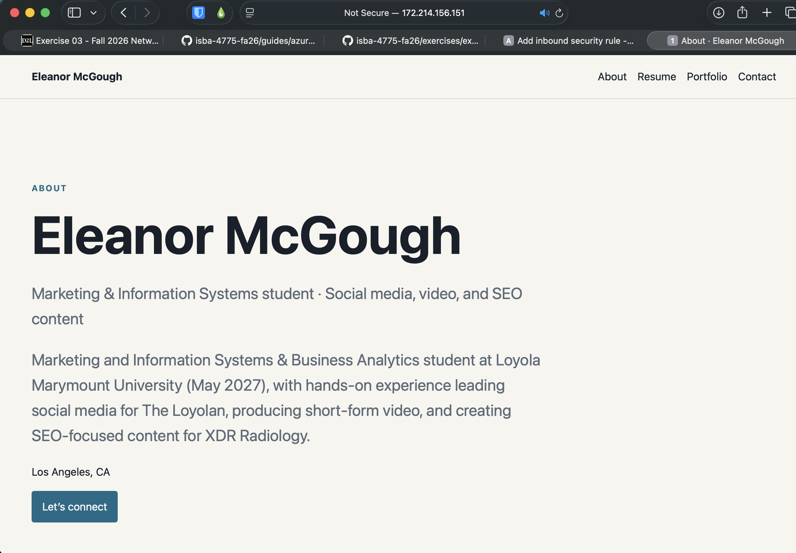

# Exercise 03 Evidence

## 1. VM details

| | |
|---|---|
| VM name | vm-career-platform |
| Resource group | rg-career-platform |
| Region | North Central US (northcentralus) |
| Size | Standard_B2ats_v2 (2 vCPUs, 1 GiB memory) |
| Public IP | 172.214.156.151 |

My region and size are different from the guide because my Azure for Students
subscription wasn't allowed to use West US 2, and Standard_B2ts_v2 wasn't
offered to my subscription in the regions I could use. Standard_B2ats_v2 has
the same 2 vCPUs and 1 GiB of memory.

## 2. Screenshot

Port 8000 was open when I took this screenshot.

I took this while the Temp-HTTP-8000 rule was open during the two-lock step.
I deleted the rule afterwards, so the site is no longer public on port 8000.

## 3. What went wrong

Originally, my home page led to a blank page with plain text reading
"career-platform is running." To get to the actual site, I had to add /about
to the end of the address. The problem was caused early on in the build plan,
not the spec: the first build step put a startup message on / as a
placeholder so we could see the server was running. My spec always meant for
the home page to be my About page, but when /about was created separately, the
placeholder was never replaced, and the only test for / just checked that the
page loaded, so nothing caught it.

To investigate, I described what I was seeing to Claude, which looked at the
code for / and compared it to the spec. We fixed it by having / redirect to
/about, meaning the server tells my browser "go to /about instead," which is
why /about now shows up in the address bar automatically. I chose a redirect
over copying the About page onto / so there is one page at one address to
update and share.

What confirmed the fix was a test that failed before the change and passed
after, and then loading / on the VM and landing on my About page with my name.

## 4. The change

The command hangs because at the coffee shop I have a completely different
public IP address, and my SSH rules only allow my school and home IPs, so Azure
silently drops the connection. To fix the typo, I would sign in to the Azure
portal, create a temporary rule allowing port 22 from the coffee shop's IP,
SSH in, and delete the rule when I'm done. The rule is free and quick to make,
so the main cost is forgetting to delete it, since anyone on that network, now
or later, could reach my VM's SSH login, though they'd still need my private
key to get in.
