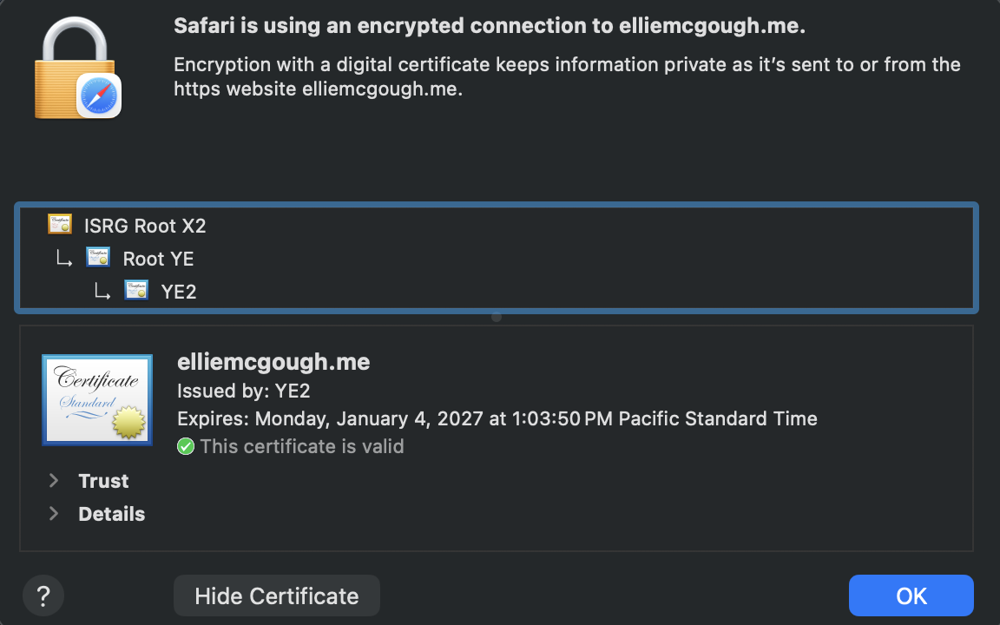

# How this site is secured

**Question: How do I know my data to your site is encrypted?**

## The certificate

My site's domain is `elliemcgough.me`. The certificate covers this name and `www.elliemcgough.me`.

The certificate is issued by Let's Encrypt. It started on October 6, 2026 and expires on January 4, 2027.

## Renewal

Certbot renews the certificate automatically before the expiration date. Renewing earlier than the expiration date matters in case Certbot fails for any reason.

The renewal dry run shows that automatic renewal works for both names:

```
azureuser@vm-career-platform:~$ sudo certbot renew --dry-run
Saving debug log to /var/log/letsencrypt/letsencrypt.log

- - - - - - - - - - - - - - - - - - - - - - - - - - - - - - - - - - - - - - - -
Processing /etc/letsencrypt/renewal/elliemcgough.me.conf
- - - - - - - - - - - - - - - - - - - - - - - - - - - - - - - - - - - - - - - -
Simulating renewal of an existing certificate for elliemcgough.me and www.elliemcgough.me

- - - - - - - - - - - - - - - - - - - - - - - - - - - - - - - - - - - - - - - -
Congratulations, all simulated renewals succeeded:
  /etc/letsencrypt/live/elliemcgough.me/fullchain.pem (success)
- - - - - - - - - - - - - - - - - - - - - - - - - - - - - - - - - - - - - - - -
```

The timer check shows the `certbot.timer` is active. It last ran on Oct 8 at 00:28 UTC, and the next check is at 14:25 UTC:

```
azureuser@vm-career-platform:~$ systemctl list-timers | grep certbot
Thu 2026-10-08 14:25:51 UTC       12h Thu 2026-10-08 00:28:54 UTC  1h 5min ago certbot.timer
```

## Open ports

My Azure network security group has inbound rules for three ports: 22, 80 and 443.

- **Port 22 (SSH):** This is how I SSH into the VM to manage the server. It has two rules, one for my public IP at school and one for my public IP at home, so only those two IP addresses can connect to it. My coding agent runs on my laptop, so it connects from the same IP as me and has no separate way in.
- **Port 80 (HTTP):** Open to anyone. It is safe to leave port 80 open because Nginx automatically redirects the browser to HTTPS, so no one can use the site unencrypted. A plain-HTTP request gets a `301 Moved Permanently` pointing to `https://elliemcgough.me/`:

  ```
  azureuser@vm-career-platform:~$ curl -I http://elliemcgough.me
  HTTP/1.1 301 Moved Permanently
  Server: nginx/1.24.0 (Ubuntu)
  Date: Thu, 08 Oct 2026 01:56:20 GMT
  Content-Type: text/html
  Content-Length: 178
  Connection: keep-alive
  Location: https://elliemcgough.me/
  ```
- **Port 443 (HTTPS):** Open to anyone. This is the encrypted connection that uses the certificate. For example, people on LMU's network can't access the website unless it is encrypted, since the school network blocks it.

The app's own port, 8000, is not open to the internet (see below).

## Where encryption starts and ends

Encryption starts at the visitor's browser, and the connection is encrypted between the browser and Nginx. Nginx holds the certificate, so it decrypts the request on the VM and forwards it to the app.

127.0.0.1 is the standard loopback IP address, also known as localhost, which lets a computer communicate directly with itself. Nginx forwards requests to the app at 127.0.0.1:8000 on the same VM, so that traffic never goes over a network where someone could intercept it. Because the app only listens on 127.0.0.1, no one on the internet can connect to port 8000 directly and skip Nginx and HTTPS.

This check on the VM shows the app (uvicorn) listening only on 127.0.0.1:8000:

```
azureuser@vm-career-platform:~$ ss -ltnp | grep 8000
LISTEN 0      2048       127.0.0.1:8000      0.0.0.0:*    users:(("python",pid=12932,fd=3),("python",pid=12931,fd=3),("uvicorn",pid=12927,fd=3))
```

## How a customer can check the certificate in Chrome

In Chrome, a customer can check the certificate like this:

1. Go to `https://elliemcgough.me`.
2. Click the icon to the left of the domain.
3. Click **Connection is secure**.
4. Click **Certificate is valid**.

It should show the certificate was issued to `elliemcgough.me`, issued by Let's Encrypt (YE2), and expires on January 4, 2027.

I don't have Chrome, so I checked in Safari 26.6 instead. In Safari, I clicked **Safari** in the top menu bar, then **Connection Security Details**. It shows an encrypted connection to my domain, and it shows when the certificate expires: January 4, 2027 at 1:03:50 PM Pacific, the same time as the `notAfter` date in my openssl output (21:03:50 GMT). It also says "This certificate is valid."

YE2 is the name of one of Let's Encrypt's intermediate certificates. It signed my certificate, and it traces back to Let's Encrypt's root, ISRG Root X2, which Safari already trusts. That chain is why the certificate shows as valid.



## openssl output

This command connects to my live site on port 443 the same way a browser would, and prints the subject, issuer and validity dates of the certificate it receives:

```
azureuser@vm-career-platform:~$ echo | openssl s_client -connect elliemcgough.me:443 -servername elliemcgough.me 2>/dev/null | openssl x509 -noout -subject -issuer -dates
subject=CN = elliemcgough.me
issuer=C = US, O = Let's Encrypt, CN = YE2
notBefore=Oct  6 21:03:51 2026 GMT
notAfter=Jan  4 21:03:50 2027 GMT
```
